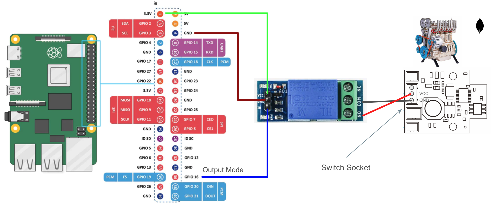
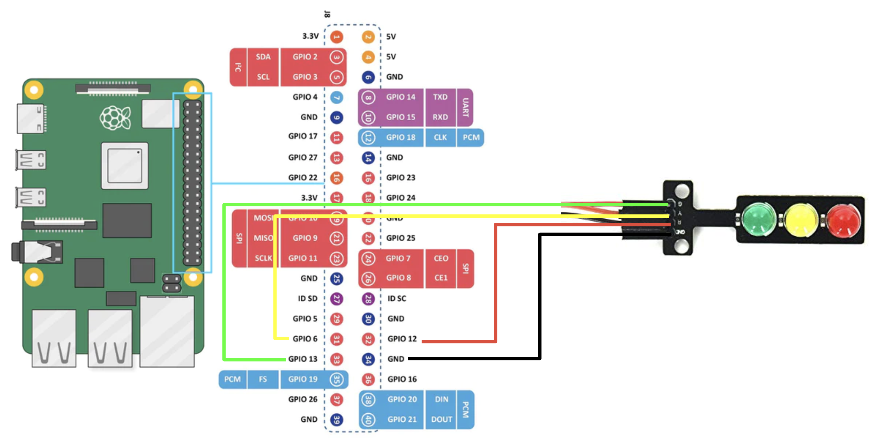
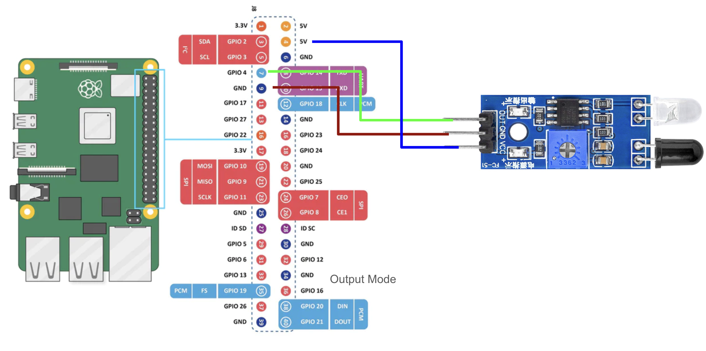

# Acoustic Based Real Time Diagnosis for machines using Vector Search


In this repo we will show how MongoDB Atlas can be used for a fully comprehensive connected equipment loop, from using Vector Search to diagnose the status of a machine based on its real-time sound, to connecting to AWS Bedrock to receive human readable reports that can be used by operators to fix the machine. And finally use MongoDb to store operational equipment data to create alerts or dashboard and understand how the production process is going. 

In the curren era of connected equipments, companies can use all the potential of MongoDB's tools (not just data storage) to increase productivity, reduce downtime, TCO and MTTR, across others. MongoDB can integrate fully with your current SCADA, MES or ERP systems through our Drivers, Change Streams, MQTT partners and much more. 

In this demo we want to show the comprehensive nature of MongoDB and how all its tools can be used in a really powerful combination. To take it to reality, we are utilizing real hardware combined with Software. If you want to replicate this demo, you have two options:

a) Copy our setup as close as possible. We will share below all the hardware components we have. 

b) We will have a 'lite' version of this demo where through a simulator, you will be able to replicate it without the need of the hardware. 


In a very high level, this demo is composed of 3 main components: 
- The Hardware --> A 4-cylinder Engine scaled replica. Teching DM13
- The Cloud --> MongoDB Atlas and its products. 
- The Connection between Hardware and Cloud -->  A Raspberry Pi 5.

Now let's get into details to explain all the parts the demo has, how they are connected and how to replicate it.


## Hardware  
To replicate the real use case of a machine, we are using the 4-cylinder Engine replica Teching DM13. We decided to use this specific hardware because it's all made of metal, which makes it more sturdy for traveling and testing, and also because it was the right combination of cost, size and functionality between all the hardware we evaluated. But in reality this demo can be run with any piece of hardware (even a real machine!) that can run and make some noise. 


The product requires the user to assemble the parts, and the parts move thanks to an electric motor connected to a set cog wheels, and chains that make its parts move. The electric motor is powered by a 500mAh Lithium Battery that can be charged.

This is an standalone product, that has a ON/OFF manual switch to power it. In order for us to be able to control the engine through MongoDB Atlas, we had to intervene. 


That meant to connect the ON/OFF manual switch to a Relay (which is simply an electronically operated switch), so we don't have to turn the switch to our hands. Then, we connected the Relay to a Raspberry Pi 5 which will be the bridge to host the software that communicates with the Cloud. 

### Raspberry Pi 5

We are going to use a Raspberry Pi 5 8GB for this demo. Here's the detailed information about our specific model:

    OS: Ubuntu 23.10 aarch64 
    Host: Raspberry Pi 5 Model B Rev 1.0 
    Kernel: 6.5.0-1009-raspi Shell: bash 5.2.15 
    DE: GNOME 45.2 
    WM: Mutter 
    WM Theme: Adwaita 
    Theme: Yaru [GTK2/3] 
    cons: Yaru [GTK2/3] 
    Terminal: gnome-terminal 
    CPU: BCM2835 (4) @ 2.400GHz 
    Memory: 1927MiB / 7943MiB 

Additionally, there are a few extra items we got:
- 27W Power Delivery (The 15W power adapter won’t be enough to power the all the items)
- MicroSD of 256GBs, this is to store the OS.
- Cable HDMI-mHDMI 2.0

For this demo we used the 5V relay KF-301:


### Hardware Connections 
This is how we electrically connected the Raspberry Pi (left of the image) to the Relay, and the Relay to the ON/OFF switch sockets of the engine (right of the image)



##### Traffic Ligth Sensor Cable Schematic

##### Proximity Sensor Cable Schematic



> [!TIP]
> The python scripts used on this demo refer directly to specific pins, so make sure you either follow the above schematic exactly, or you edit the scripts on `engine_controler/` so the program uses the necessary pins of the Raspberry Pi. 

By the end, the RPi should have 3 things connected to its pins:
- Relay to control the engine
- Traffic Light Sensor
- Infrared Proximity Sensor

And this is it! congratulations on setting up the physical connection of the hardware, now let's go an run the programs on the Raspberry Pi 5!

## Raspberry Pi Control
To run the programs open 3 terminals:

In one terminal type:
`cd engine_controler`
`node server.js`

In the other terminal terminal:
`cd engine_controler/realm`
`node app.js`

In the last terminal:
`cd engine_controler`
`python3 sensors_read.py`

Now all the Sensors on the Raspberry Pi should be running!!!! :D 

#### Basic Troubleshooting
- If you see weird behaviors with the Sensors (Relay Clipping, LEDs not turning On, InfraRed Sensor not working, engine turning on and off constantly)
  - Disconnect the engine (always first)
  - Make sure there are no obstacles obstructing the IR (Infrared) sensor
  - Double check the cable connections
- If you see some errors on the Terminals
  - Disconnect the engine (always first)
  - Stop the Terminals
  - Go to Atlas and make sure everything is working fine in Atlas. 
  - Re-start the programs


## MongoDB Atlas Setup

### Part 1 - MongoDB Atlas Backend

In order to the make the demo work end-to-end, you will need to set up the backend. Let's get started! 

### Setup the MongoDB Atlas Backend

1. Go to [MongoDB Cloud](https://cloud.mongodb.com/) and create user account.
2. Under the Data Services tab, click "Database" in the sidebar, then "+ Create" and [create a new MongoDB cluster](https://www.mongodb.com/docs/atlas/tutorial/create-new-cluster/) in your preferred region and call it ```Connected-Products```. <br>You can choose a Free, Serverless, or Dedicated cluster.
3. Go through the access configuration setup depending on your needs. Usually defaults are fine. 

## Setup App Services and create an App
You can also follow the instructions on [this page](https://www.mongodb.com/docs/atlas/app-services/apps/create/#create-an-app-services-app) and create an app from the template 'Real-time Sync'. However, here are also the steps to follow:
1. [Install the App Services CLI](https://www.mongodb.com/docs/atlas/app-services/cli/#installation). This will allow you to manage your Applications through the terminal. 
2. [Generate API key](https://www.mongodb.com/docs/atlas/app-services/cli/#generate-an-api-key), assign the `Project Owner` permission and add your IP address to the access list
3. [Login with your API key](https://www.mongodb.com/docs/atlas/app-services/cli/#authenticate-with-an-api-key)

4. In the terminal, on this repository and import the application with the command:

    `appservices push --local ./Connected-Vehicle-Edge-Server --remote Connected-Vehicle-Edge-Server` 

    You will be prompted to configure the app [options](https://www.mongodb.com/docs/atlas/app-services/cli/appservices-push/#appservices-push). Set them according your needs. If you are unsure which options to choose, the default ones are usually a good way to start! 

    4.a If you are building this app on an existing cluster that isn't named `Connected-Products`, you should go to `/Connected-Vehicle-Edge-Server/data_sources/mongodb-atlas/config.json` and edit the `clusterName` field such as `"clusterName": "<your-cluster-name>",`

    After you've chosen your options, you should see the following appear: 

        App created successfully
    
        ...
    
        Successfully pushed app up: Your App ID 
    
    Your App ID should be in the following format: YourAppName-XXXXX

5. Create the demo user by pasting the following into your command shell: `appservices users create --type email --email demo --password demopw`. Be sure to change the default password. You then have to provide the previously received App ID or just type the application name `Connected-Vehicle-Edge-Server`.

    You should see the following appear: 
        
        App ID or Name (here you'll insert your App ID) 
        Successfully created user
        {
            "id": , 
            "enabled": , 
            "email": ,
            "type":
        }

> [!IMPORTANT]
> Copy/Save the User ID that appears in the terminal, we will use it in the following step.

6. Run the following command: `appservices apps list` to check if your app has been created. 
    
    You should see the following appear: 
        
        Found 1 apps
        Client App ID                        Project ID                _id                     
        -----------------------------------  ------------------------  ------------------------
        your-app-id                          your-project-id           app-_id


Now we are going to insert in MongoDB the document we are going to use for this demo!

7. Go to [MongoDB Cloud](https://cloud.mongodb.com/) and click Connect on the cluster you created for this project.
   
8. Select Shell in the "Access your data through tools" Section.

9. Install MongoDB Shell if necessary and follow the instructions to connect to MongoDB through the Terminal. To install you should run:

    `brew install mongosh`

Then run `mongo "<your_connection_string>"` to access the JS-based Shell environment. 
If you connected correctly, you should see:

```
Current Mongosh Log ID:	<current log ID>
Connecting to:		<your_connection_string>
Using MongoDB:		<API Version 1>
Using Mongosh:		<current mongosh version>
```

10. Switch to the appropriate database. It should be `Connected-Products`
    Run `use Connected-Products`
11. Insert the document by running the comand below:
```
db.vehicle_data.insertOne({
  "LightsOn": false,
  "Battery_Temp": 26.0,
  "Battery_Current": 72.0,
  "Battery_Status_OK": true,
  "Vehicle_Name": "My Car",
  "Driver_id": "<your_user_ID>",
  "Driver_Door_Open": false,
  "Hood_Open": false,
  "Engine_Status": "Engine Off"
})
```
> [!IMPORTANT]
> Change the Driver_id value, and substitute it with the user ID we copied in Step 5


12. Congrats! The first part is done.

## Audio-Based Real time Diagnostic using MongoDB Vector Search
Demonstration of MongoDB's Vector Search capabilities for anomaly detection through sound input. This demo enables real-time diagnosis by analyzing the emitted audio, allowing us to diagnose its condition—whether it's operating normally, stopped, or experiencing any issues.

### 1. MongoDB Atlas Connection
Create a file called `.env` in the main directory alongside the `add_audio.py` file and add your atlas connection string, in the following format:  

`MONGO_CONNECTION_STRING="mongodb+srv://connectionstringfromatlas"`

### 2. Install Python Modules

Install the required python modules.

`pip install pyaudio`

`pip install numpy`

`pip install pymongo`

`pip install librosa`

`pip install panns_inference`

`pip install torch`

`pip install python-dotenv`

`pip install certifi`

### 3. Record Audio Files

Run `python add_audio.py`

Select the audio input by typing the relevant number and then press enter. Record each sound in sequence.

> [!TIP]
> We recommend using an external microphone and placing it very close to the fan or audio source.

### 4. Create a Search Index

Go to MongoDB Atlas and create an Atlas Search Index in the **audio** database **sounds** collection and using the content of `searchindex.json`

```
{
    "mappings": {
      "dynamic": true,
      "fields": {
        "emb": {
          "dimensions": 2048,
          "similarity": "cosine",
          "type": "knnVector"
        }
      }
    }
  }
```
### 5. Query the Database

Run `python live_query.py` and place your microphone next to the fan.

## Integration with AWS Bedrock

We have followed a simple approach to integrate with AWS Bedrock, which can serve as a baseline for more complex approach implementing more real time data from sensors and even implementing a RAG architecture.  

We are going to use Atlas Functions to integrate with AWS Bedrock:


```js
exports = async function(changeEvent){
  // To see plenty more examples of what you can do with functions see: 
  // https://www.mongodb.com/docs/atlas/app-services/functions/
  
  const {
    BedrockRuntimeClient,
    InvokeModelCommand,
  } = require('@aws-sdk/client-bedrock-runtime');
  
  const text_decoding = require('text-decoding');
  
  var config = ({
    region: "eu-central-1",
    credentials: {
      accessKeyId: context.values.get(`AWS_ACCESS_KEY`),
      secretAccessKey: context.values.get(`AWS_ACCESS_SECRET_VALUE`),
    }
  });
  
  const client = new BedrockRuntimeClient(config);
  latest_status = changeEvent.fullDocument.results[0].audio
  //let latest_status = "Hard Material Hit"
  let abnormal_keyword = ""
  if (latest_status == "Soft Material Hit" || latest_status == "Metallic Hit"){
    abnormal_keyword = "Abnormal"
  } 
  else {
    console.log("no report")
    return
  }

  const serviceName = "mongodb-atlas";
  const vehicle_data_DB = "Connected-Vehicle-Edge-Server";
  const coll_name = "vehicle_data";
  const vehicle_data_coll = context.services.get(serviceName).db(vehicle_data_DB).collection("vehicle_data");
  
 const query = { Driver_id: "6584053032d5b2616b7b635c" };

  
  const batteryData = await vehicle_data_coll.findOne(query);
  
  
  const input = {
   "modelId": "amazon.titan-text-express-v1",
   "contentType": "application/json",
   "accept": "application/json",
   "body": `{\"inputText\":\"Engine Acoustic-Based Status: ${abnormal_keyword} ${latest_status}, Battery Temperature: ${batteryData.Battery_Temp} Degrees, Battery Percentage: ${batteryData.Battery_Current}, Create a comprehensive status report for this engine based on a 4-cilinder engnine. Start with the report here:\",\"textGenerationConfig\":{\"maxTokenCount\":8192,\"stopSequences\":[],\"temperature\":0,\"topP\":1}}`
  }

  
  const command = new InvokeModelCommand(input);
  
  let data, completions;
  
  try {
    data = await client.send(command);
    
    
    response = JSON.parse(new text_decoding.TextDecoder().decode(data.body));
    
    
    const output_text = response.results[0].outputText
    
        const timestamped_output = `${new Date().toISOString()}: ${output_text}`; // Prepend timestamp

    console.log(timestamped_output);
    
    const local_dashboard_response = await context.http.post({
      url: "NGROK URL",
      body: { msg: timestamped_output },
      encodeBodyAsJSON: true
    })
    
  } catch (error) {
    console.error(error);
  }
  
  return;

};
```


## 3D Digital Twin 

In order to set up this part of the demo, please follow the instructions in the following repo


#### [Connected Vehicle Demo](https://github.com/mongodb-industry-solutions/Connected-Vehicle-Edge-Server)


## Real-Time Production Quality Dashboard 

This Dashboard utilizes embeded MongoDB Atlas Charts to show the overall status of the engine as well as the history of status 

We are using a combination of Atlas Triggers, Charts, Functions, the Bedrock API, and a simple express web server to host the dashboard. So before running it you should have setup all the previous steps correctly. This would be the last step. 

In order to run it follow this steps:

`cd express-web-server `

`npm install`

`node app.js`

